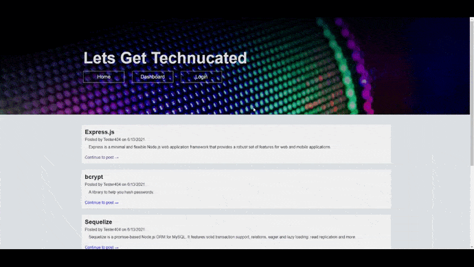

# Tech Blog

[](https://opensource.org/licenses/MIT)

## Description

A blog website that allows developers to publish posts and comment on other posts. 

The application follows the MVC paradigm in its architectural structure, uses Handlebars.js as the templating language, Sequelize as the ORM, and the exxpress-session npm package for authentication.

## 📖Table of Contents
1. [Installation](#installation)
2. [Usage](#usage)
3. [Assets](#assets)
4. [Technologies](#Technologies)
5. [License](#license)
6. [Contributing](#contributing)
7. [Tests](#tests)
8. [Questions](#questions)

## Installation
1. To install this application clone it through GitHub using the following code in the terminal: 
    ``` 
    git clone https://github.com/TrushilBudhia/Tech-Blog.git
    ```
2. To add the dependencies to the application, navigate to the root directory for the application and run:
    ```js
    npm install
    ```
    
## Usage
Once the host, port, user, password and database details have been provided to the connection and the database has been created, navigate to the root directory for the application and run the following code in the terminal to start the application:
```js
npm start
```

## Assets
Live demo of the application hosted on Heroku: [Tech Blog - Lets Get Technucated](https://lets-get-technucated.herokuapp.com/)

The following images shows the functionality of the application: 




## Technologies
- [Node.js](https://nodejs.org/en/docs/)
- [dotenv](https://www.npmjs.com/package/dotenv)
- [Express](https://expressjs.com/)
- [mysql2](https://www.npmjs.com/package/mysql2)
- [Nodemon](https://www.npmjs.com/package/nodemon)
- [Sequelize](https://sequelize.org/v5/index.html)
- [bcrypt](https://www.npmjs.com/package/bcrypt)
- [Connect Session Sequelize](https://www.npmjs.com/package/connect-session-sequelize)
- [Express Handlebars](https://www.npmjs.com/package/express-handlebars)
- JavaScript

## License
Copyright © 2021 [Trushil](https://github.com/TrushilBudhia)

This project is [MIT](./LICENSE) licensed

## Contributing
Contributions, issues and feature requests are welcome.

Feel free to check the [issues page](https://github.com/TrushilBudhia/Tech-Blog/issues) if you want to contribute.

## Tests
There are no tests currently for this application.

## Questions
For any questions, please contact the author:

- Github: [@Trushil](https://github.com/TrushilBudhia)
- Email: trushil.budhia@gmail.com

